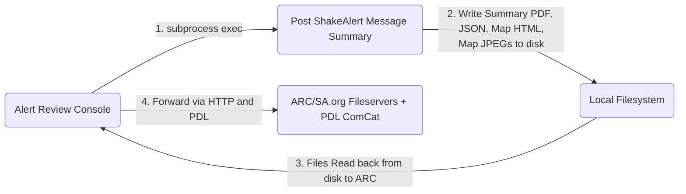

# Post ShakeAlert Message Summary Architecture

## High Level Description

The Post ShakeAlert Message Summary project (PSAMS) (referred to in the past
as Post Event Summary, and Post Alert Summary) is python application used to
generate reports containing a summarized description of ShakeAlert activity.
The resulting summary data is issued in both PDF and GeoJSON formats.

PSAMS was mainly developed for automated use by the Alert Review Console (ARC)
by means of subprocess exec call to the PSAMS CLI.  The CLI is made a priority
to allow a human user to run/re-run the generation of a summary when testing.

## Post ShakeAlert Message Summary Dataflow Diagram

## Code Map

* PDFCreate.py
  * Main module. Program CLI arg definitions.
* PyCities.py
  * Functions for calculating nearest cities from a city list
    config and chanfile
* PyEventImage.py
  * Code related to drawing HTML maps using Leaflet.js.
* ShakeAlertParser.py
  * Parses ShakeAlert JSON data from ARC.
* utils.py
  * Defines functions/classes used across all modules.
* tests/tests.py
  * Defines program unit tests using pytest framework.
* tests/test_end2end.py
  * Runs an end-to-end test on each file in the test_files input directory.
* params/chanfile_plum.dat
  * Chanfile used in nearest cities calculation.
* params/city_list_[A|B].txt
  * City names and locations used to build nearest cities section. List A
    contains a small list of high population cities, while list B
    contains higher smaller cities for higher granularity.
* params/PostEventSummaryProperties.cfg
  * Primary config file used to configure machine specific and values related
    to business logic (ie. magnitude thresholds).

## Project Development Practices

This code is in ongoing refactoring.  It's encouraged to use flake8 to
move closer PEP8 compliant formatting to match the python ecosystem.

## Quirks

Python source files are placed in a dir called "bin" which is a reserved word
in python.  This causes issues with python's module import system making it
difficult to import objects into other modules (pytest modules used for unit
testing as one example).  As a result, tests.py contains some workarounds
module loading code to enable access from pytest.
